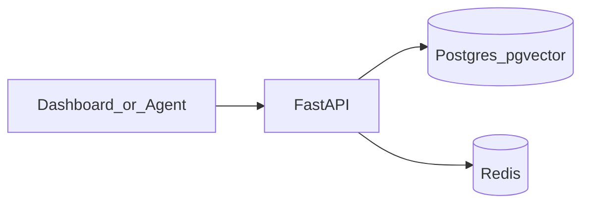

# Architecture

## Components

- **FastAPI** (`apps/api`): REST API, hybrid retrieval, JWT + agent keys.
- **PostgreSQL + pgvector**: Relational data, `tsvector` full-text search, cosine similarity.
- **Redis**: Reserved for caching/rate limits (hook-up point).
- **Next.js** (`apps/web`): Dashboard for memory CRUD, hybrid search UI, basic graph view.

## Data flow

## Scoring (hybrid)

Default fusion in SQL:

`score = w_sem * semantic_sim + w_kw * ts_rank + w_rec * exp(-age_days/30) + w_imp * importance + recency_boost`

Weights are tunable in `apps/api/app/services/search.py`.

## RLS model

Session variable `app.current_tenant_id` must be set for tenant-scoped reads/writes on protected tables. `tenants`, `users`, and `memberships` are not RLS-protected so bootstrap login remains ergonomic.

## Encryption

Envelope-style helpers derive per-tenant keys from `MASTER_KEY` + `tenant_id`. In production, replace with cloud KMS and rotate DEKs regularly.
